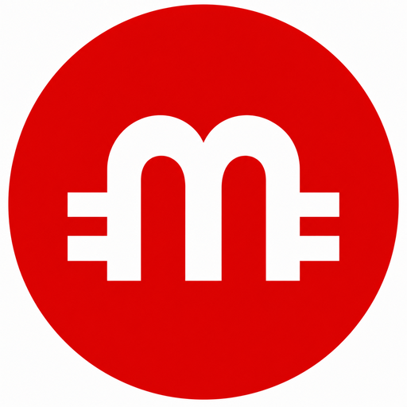

MarioCoin 0.1.4 BETA
====================

Copyright (c) 2011-2013 MarioCoin Developers
Distributed under the MIT license, see COPYING.

What is MarioCoin?
------------------
MarioCoin is a peer-to-peer internet currency. It is based on the
Bitcoin code and uses scrypt proof-of-work.

  Block time ....... 90 seconds
  Retarget ......... every 240 blocks
  Block reward ..... 50 MRC, halves every 840000 blocks
  Total coins ...... 84,000,000 MRC
  P2P port ......... 19484
  RPC port ......... 19485

Build
-----
  make -f makefile.unix

Run
---
  ./mariocoind -daemon

Copy mariocoin.conf.example to ~/.mariocoin/mariocoin.conf and change
rpcuser and rpcpassword before you start the daemon.

Mining
------
See doc/mining.txt.
